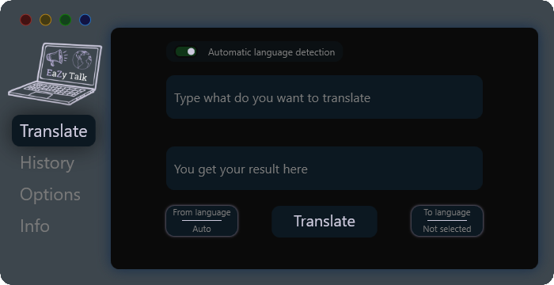
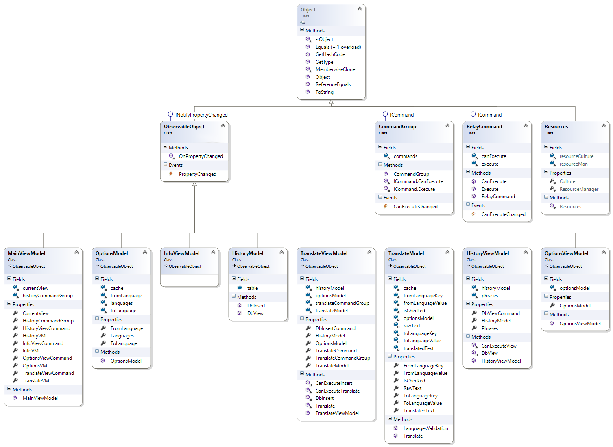

  
  <h1> EaZy Talk </h1>

EaZy Talk is a translator C# WPF application created by using the MVVM pattern.

## Table of Contents
* [General Info](#general-information)
* [Technologies Used](#technologies-used)
* [Features](#features)
* [Screenshots](#screenshots)
* [UML diagram](#uml-diagram)
* [Setup](#setup)
* [Usage](#usage)
* [Project Status](#project-status)
* [Room for Improvement](#room-for-improvement)
* [Acknowledgements](#acknowledgements)
* [Creator](#creator)
<!-- * [License](#license) -->

## General Information
- Translate text from foreign languages via **Google Translate API**.
- Translated sentences are saved in **SQLite** Database.
- The goal is to create a project that will be a bachelor thesis.
- I started getting in C# when time to choose a topic was came. So I decided to go in this and develop my skills.

## Technologies Used
- [.NETFramework](https://learn.microsoft.com/pl-pl/dotnet/) - version 4.5.2
- [SQLite](https://sqlite.org/) - version 1.0.117.0
- [Google Translate API](https://cloud.google.com/translate) - version 2.0

## Features
- Automatic **from** language detection.
- Saving sentences in history.
- **Always on top** possibility.

## Screenshots
### Application look
- **Main view**

  
- **History view**

- **Options view**

## UML diagram

## Setup
What are the project requirements/dependencies? Where are they listed? A requirements.txt or a Pipfile.lock file perhaps? Where is it located?

Proceed to describe how to install / setup one's local environment / get started with the project.

## Usage
How does one go about using it?
Provide various use cases and code examples here.

`write-your-code-here`

## Project Status
Project is: _in progress_ / _complete_ / _no longer being worked on_. If you are no longer working on it, provide reasons why.

## Room for Improvement
Include areas you believe need improvement / could be improved. Also add TODOs for future development.

Room for improvement:
- Improvement to be done 1
- Improvement to be done 2

To do:
- Feature to be added 1
- Feature to be added 2

## Acknowledgements
Give credit here.
- This project was inspired by...
- This project was based on [this tutorial](https://www.example.com).
- Many thanks to...

## Creator
Created by [Piasta](https://github.com/Piasta/).

<!-- Optional -->
<!-- ## License -->
